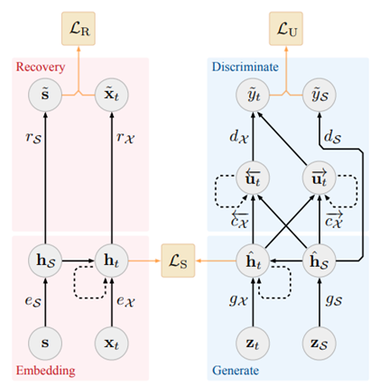
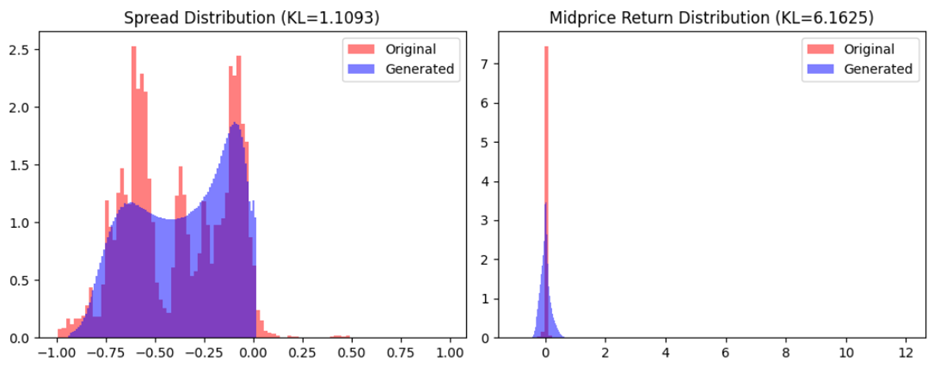
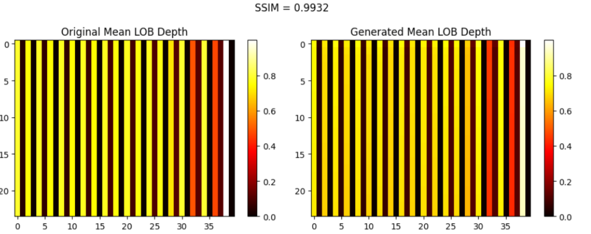
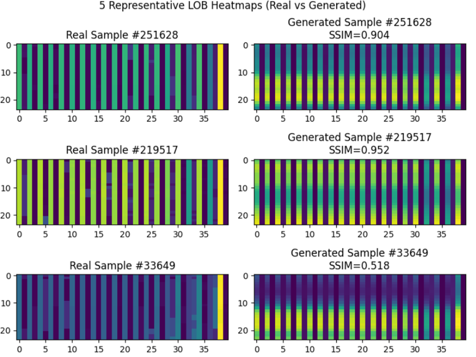
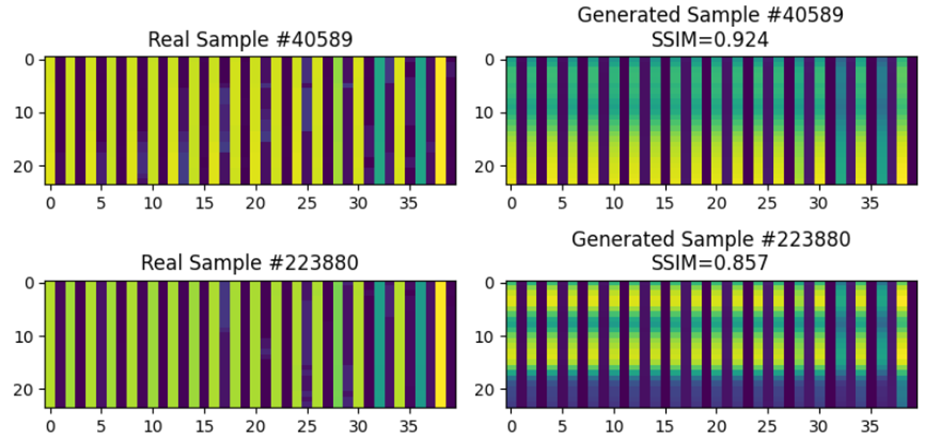

# Generative Time Series Model using TimeGAN 
## Context
Time series data is a collection of numerical data points observed or measured in a specific order over a continuous period, such as minutes, days, months, or years. This chronological order allows for the identification of trends, patterns, and seasonality, making it useful for forecasting and making informed decisions. An example of time series data includes stock data such as limit order book (events), where buy and sell orders can fluctuate based on the time during the day. Limit order books (LOB) are split into  ask and bid prices as well as the quantity, with the oldest book at the top while the most recent book sits at the bottom. For this project, the Amazon level 10 orderbook will be used, with ask prices and volume shown from Column 0 to Column 20 (from lowest to highest price) while bid prices and volume are displayed from Column 21 to column 40 (from highest to lowest price). 
## Limit Book Order (LOB) Problem Space
In the real world, high quality LOB are extremely valuable since they are proprietary, expensive, and limited to large institutions. Due to privacy and confidentiality issues, real orderbook data cannot be shared freely from fear of potentially exposing trading strategies. Regulatory constraint can also restricts data sharing across different jurisdictions and country regulations. Training machine learning models for price prediction and market simulation often require a lot of realistic data, which cannot always be provided. Therefore, synthetic LOB generation provides unlimited, privacy preserving and statistically consistent sequences for model training, testing and simulation. Modelling and simulating LOBs is quite often necessary for calibrating and fine-tuning the automated trading strategies developed in algorithmic trading research (Konark Jain, Nick Firoozye, Jonathan Kochems, Philip Treleaven, 2023).
## Description of Algorithm
TimeGAN was implemented to generate new realistic time series data for Amazon LOBs. It is trained adversarial and jointly via a learned embedding space with supervised and unsupervised losses.  It combines supervised sequence modelling (RNN autoencoding) with unsupervised adversarial training (GAN) to generate realistic time-series sequences that preserve temporal dynamics. This ensures latent space consistency as the real and synthetic sequences share the same hidden representation space (Jinsung Yoon, Daniel Jarrett, Mihaela van der Schaar, 2019).

The model uses RNNs (with GRU implementation) to learn temporal dependencies between order flow reactions. The model employs an autoencoder with the embedding module as the encoder stage and recovery module as the decoder stage to learn compressed latent representation of corelated variables. Supervised next step predictions enforces temporal coherence instead of point wise similarity which helps identify trends in ask price and bid prices. This helps capture a more realistic view of the data to create sufficient synthetic LOBs. 
## General Architecture
The model is divided into 5 main modules: \
	1. **Embedder**: converts real sequences into latent representations\
	2. **Recovery**: converts latent representation into reconstructed sequence\
	3. **Generator**: converts random noise into latent representation\
	4. **Supervisor**: helps the generator learn temporal dependencies\
	5. **Discriminator**: distinguishes real and fake latent sequences

The generator and supervisor are trained to fool the discriminator, creating adversarial competition. 

 
***1. Embedder***\
The embedder is the encoder part of the autoencoder. It maps each real sequence into a hidden (latent) space that captures the temporal structure and underlying features of the data

***2. Recovery***\
The recovery module is the decoder part of the autoencoder. It reconstructs the original time series from its latent representation. Training the embedder and recovery module together ensures the latent space preserves real temporal information 

***3. Generator***\
The generator module learns to produce fake latent representations that look like the real latent space H. Instead of directly generating data, it generates latent sequences which are decoded by the Recovery Module. It is trained adversarial to fool the discriminator module and also supervised by the Supervisor to preserve time dependencies

***4. Supervisor***\
The supervisor teaches the generator to produce sequences that follow realistic temporal dynamics.

$$ 
{L_s}=|(|H_{t+1}-S{H_t}|)|^2 
$$

This acts as a temporal consistency constraint – the generator learns not just to produce realistic points but realistic transitions between timesteps

***5. Discriminator***\
The discriminator enforces realism in the latent space. It tries to distinguish between the real latent sequences (from the embedder) and fake latent sequences (from the generator and supervisor)

## File Structure
* **dataset.py**: contains the data loader for loading and preprocessing the data. Uses min max normalisation to scale the data
* **modules.py**: contains the modules required to run the TimeGAN such as Embedder, Recovery, Generator, Supervisor, and Discriminator
* **predict.py**: allows visualisation of 5 representative heatmap visualisation as well as KL divergence graph and visual similarity using SSIM
* **train.py**: contains the main function for running dataset.py for data preprocessing, modules.py for training the TimeGAN and predict.py to visualise the results
* **utils.py**: additional helper functions required for training the TimeGAN such as train_test_divide(), rnn_cell() and batch_generator()
## Running Instructions
Download the orderbook dataset for Amazon LVL 10 and save it in the same directory\
Open terminal and enter the following command:

    python timegan_driver.py

## Dependencies Used 
	import torch
	import torch.nn as nn
	import torch.optim as optim
	import numpy as np 
	import matplotlib.pyplot as plt
	from skimage.metric import structural_similarity as ssim
	from scipy.stats import entropy
    import gc
    import os
    import time
## Hyperparameters
* **hidden_dim** : number of hidden units in GRU layers
* **num_layers** : number of layers in GRU
* **iterations** : number of training iterations (epoch times batches)
* **batch_size** : number of samples per batch
* **module_name** : name of module (gru, lstm)
## Implementation
### Before Training
***Min Max Normalisation***\
Min-max normalisation was utilised to transform data during preprocessing. Min-max normalisation rescales the data such that all features lie between 0 and 1. This helps models train faster and prevent large scale data (higher bid/ask prices) from dominating smaller scale such as lower ask/bid prices which reduces skewness and bias in learning.This ensures that each feature contributes proportionally to the model's learning process (datacamp, 2024).

$$ 
x'=\frac{x-x_{min}}{x_{max}-x_{min}} 
$$

Firstly the vector of minimum values per feature is calculated. The data is then shifted such that the smallest value becomes 0. The vector of maximum values per feature is calculated and each feature is divided by the corresponding maximum to scale to obtain normalised data in the range [0, 1].
### During Training
***Adam Optimiser***\
A key element used for the optimizers is the Adam Optimiser, which was utilised for Embedder, Generator and Supervisor modules. Adam (Adaptive Moment Estimation) optimizer combines the advantages of Momentum and RMSprop techniques to adjust learning rates during training (GeeksforGeeks, 2025). Momentum accelerates the gradient descent process by incorporating a weighted moving average which allows the algorithm to converge faster. Meanwhile, RMSprop uses an exponentially weighted moving average of squared gradients, which overcomes the problem of diminishing learning rates. 

$$
w_{t+1} = w_t - \alpha \frac{m_t}{\sqrt{v_t} + \epsilon}
$$

The learning rate α used for TimeGAN was 0.00005 while the decay rates $β_1$ and $β_2$ are 0.4 and 0.9 respectively.

***MSE Loss Functions***\
The basis for loss functions used such as masked MSE were based means square error (MSE) loss functions. It measures the average squared differences between predicted and actual values (Learning, 2025). In this case, MSE loss penalises squared difference between predicted and true stock price values. BCE loss is used in discriminator and generator adversarial training by making synthetic sequences statistically indistinguishable from real trades. MSE is used in reconstruction and supervised steps to measure how well the generator and embedder reconstructs real sequences.

TimeGAN utilises three stages of training:
* Embedded Network Training
* Supervised Loss Training
* Joint Training

***Embedding Network Training***\
The embedded training is the first phase of training where the model learns a meaningful latent representation of the LOB sequences. Before adversarial training begins, the model must learn to encode and reconstruct like an autoencoder data via the embedder and recovery module respectively. Firstly, real sequences are fed through the autoencoder to learn meaningful encoding and reconstruction. The MSE is computed to minimise differences between original and reconstructed data. Backpropagation and weights are updated to optimise embedder and recovery jointly and the process repeats until the reconstruction error is small. In summary, this phase allows the model to understand the structure of real market dynamics before it generates synthetic ones. 

This phase takes approximately 5 minutes to complete 5000 epochs with a training loss of 0.1677. 

***Supervised Loss Training***\
The supervised training is the second phase where the model learns the temporal dynamics of the latent representations. Where the embedder maps real data to the latent space $H$, the supervisor learns to predict the next hidden state $H_{t+1}$ from the current latent space $H_t$. Afterwards the generator relies on the supervisor to produce temporally consistent synthetic latent trajectories. Firstly, an optimiser is constructed that only trains the supervisor and a masked MSE loss function is defined to ensure variable-length sequences do not contribute extra zeros to the loss. The training loop is setup with batch preparation before predicting the next latent step and computing the supervised loss. Backpropagation occurs and the supervisor’s parameters are updated. 

Additionally, an extra fine tuning loop was added to realign the supervisor with the latest embedder outputs to ensure that they are synchronised before joint training starts. This reruns the supervisor phase for 1000 iterations using the finalised embedder to reduce instability, improve temporal coherence and smooths loss transitions. This also stabilises joint training so that **g_loss_s** and **g_loss_u** can start from a good baseline

This phase (including fine tuning) takes approximately 4 minutes to compute 4000 epochs (+ additional 1000 fine tuning epoch) with a training loss of 0.0256. 

***Joint Training***\
Joint training is the final phase of TimeGAN. The purpose of joint training is to enable the generator and supervisor to produce synthetic latent sequences that fool the discriminator (through adversarial learning), maintain temporal consistency (through supervised learning), maintain feature statistics of real data and keep embedding consistent with reconstruction.

Each iteration has 3 substages:
1. Train Generator and Supervisor (3 times per iteration)
2. Train Embedder and Recovery (once per iteration)
3. Train Discriminator

In the generator and supervisor substage, a forward pass is made from generator to supervisor to recovery module. Adversarial loss between generator and discriminator is defined, and the supervisor’s predicted latent next step is compared to real latent evolution to encourage temporal dynamics consistency. Mean and standard deviation moment matching loss and generator loss are computed before backpropagation and parameters for generator and supervisor are updated.

In the embedder and recovery stage, the reconstruction loss is computed to force the embedder and recovery to maintain good reconstruction quality while alignment loss ensures embedder output aligns with supervisor dynamics so that both use consistent latent space.

Discriminator training allows the discriminator to better separate real and fake latent sequences. Gaussian noise is added to regularise the discriminator, the BCE losses are computed and gradient penalty is added for stability. GAN stabilisers perform label smoothing and flipping to prevent overconfidence in the discriminator. The discriminator is only trained when it is weak to avoid overfitting.

This phase takes approximately 50 minutes to compute 5000 epochs with:
* **d_loss** (discriminator accuracy) = 2.1443
* **g_loss_u** (adversarial success) = 0.9657
* **g_loss_s** (temporal consistency) = 0.2436 
* **g_loss_v** (moment matching) = 0.0394
* **e_loss_t0** (reconstruction quality) = 0.1649

The generator learns to synthesize realistic market state trajectories, the supervisor enforces temporal realism so that prices and volumes evolve smoothly, the discriminator ensures fake order-book sequences follow the same patterns as the real data and the moment-matching term keeps means, spreads, and volatilities aligned with historical statistics. 

After the three phases of training, synthetic data is generated using all samples. The results are synthetic LOB sequences that look, behave, and distribute statistically like real market data.
## Results and Discussion
The project was conducted using A100 High RAM GPU. \
Total system RAM used was 14.4/167.1 GB, VRAM used was 8.5GB/80GB and Disk space used is 39.7/235.7 GB. \
The total runtime from preprocessing to training to synthesising took 57 minutes.

_Figure 1: KL Divergence, generated and real spread on the left and midprice return on the right_

_Figure 2: SSIM between heatmaps of generated vs real LOB depth snapshots_

_Figure 3: 5 representative heatmap visualisation of generated vs real LOBs_

Figure 1 shows that the KL divergence for spread is 0.8673 while KL divergence for midprice return is 8.7250. In the real world, midprice return are typically non-Gaussian, heavy-tailed, skewed and contains high volatility while bid-ask pricing spread are usually bounded, low variance, and near discrete tick multiples. This makes it easier for TimeGAN to learn and reproduce spread as opposed to midprice returns which is seen in the higher KL divergence in midprice returns.

Figure 2 indicates that the mean SSIM is 0.9932. Given that an SSIM of 1 indicates a perfect match, the generated image is a very accurate representation of the original mean data. Meanwhile, Figure 3 shows 5 representative heatmap visualisation of generated vs real LOBs randomly selected. The generated LOB with the highest SSIM is sample 219517 with an SSIM of 0.952 while the lowest scoring SSIM is sample 33649 with an SSIM of 0.518. The other three samples excluding the highest and lowest SSIM range from 0.857 to 0.924. Out of the five samples taken, the SSIM average was approximately 0.831. This achieved the visual similarity goal of SSIM being greater than 0.6 which suggests that the generated LOBs are visually similar to the real LOBs.  

## Conclusion
The TimeGAN was relatively accurate in its heatmaps of generated vs real LOBs based on the SSIM metric. However, the KL divergence was unable to reach 0.1, with the closest being 1.1093 from ask-bid spread. Potential improvements could work on decreasing the KL divergence to 0.1 and improving representative heatmaps such that the lowest SSIM is 0.6. This can be achieved by testing various methods such as replacing RNNs with transformer encoder to improve realism and coherence, using adaptive learning rates, adding feature matching loss and introducing temporal consistency penalty. 

## References
datacamp. (2024, January 4). What is Normalization in Machine Learning? A Comprehensive Guide to Data Rescaling. Retrieved from datacamp: https://www.datacamp.com/tutorial/normalization-in-machine-learning

GeeksforGeeks. (2025, October 04). What is Adam Optimizer? Retrieved from GeeksforGeeks: https://www.geeksforgeeks.org/deep-learning/adam-optimizer/

Jinsung Yoon, Daniel Jarrett, Mihaela van der Schaar. (2019). Time-series Generative Adversarial Networks. Vancouver.

Konark Jain, Nick Firoozye, Jonathan Kochems, Philip Treleaven. (2023). Limit Order Book Simulations: A Review. London: University College London.

Learning, A. M. (2025). Loss Functions for Autoencoders (MSE, BCE). Retrieved from ApX Machine Learning: https://apxml.com/courses/introduction-autoencoders-feature-learning/chapter-3-how-autoencoders-learn/autoencoder-loss-functions

